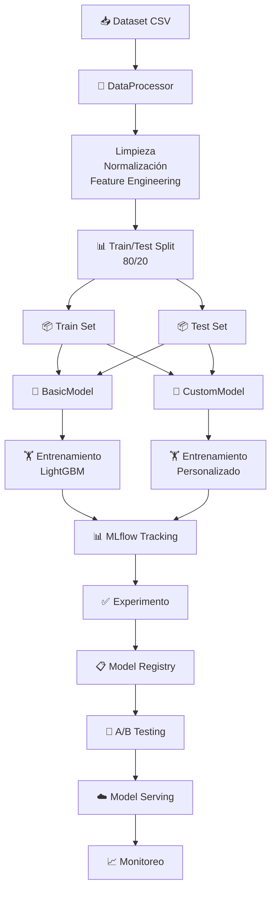

# 🦸 Marvel Characters ML Pipeline - Databricks & MLflow

Un **pipeline de machine learning end-to-end** para clasificar y analizar personajes Marvel usando Databricks, MLflow y buenas prácticas de CI/CD.


---

## 📋 Tabla de Contenidos

- [Descripción](#descripción)
- [Estructura del Proyecto](#estructura-del-proyecto)
- [Características](#características)
- [Instalación](#instalación)
- [Uso](#uso)
- [Pipeline de Datos](#pipeline-de-datos)
- [CI/CD](#cicd)
- [Configuración](#configuración)
- [Contribuir](#contribuir)

---

## 📖 Descripción

Este proyecto implementa un **pipeline completo de ML** para datos de personajes Marvel:

- **Preprocesamiento de datos**: Limpieza, normalización y feature engineering
- **Entrenamiento de modelos**: Modelos básicos y customizados
- **Tracking y Registry**: MLflow para versionado y registro de modelos
- **A/B Testing**: Comparación de modelos en producción
- **Model Serving**: Endpoints de inferencia en Databricks
- **Monitoreo**: Detección de data drift y monitoreo de rendimiento
- **CI/CD**: Automatización con GitHub Actions

---

## 🗂️ Estructura del Proyecto

```
curso_databricks/
├── 📁 notebooks/                    # Notebooks Databricks
│   ├── 01_data_preprocessing.py    # Limpieza y preprocesamiento
│   ├── 02_mlflow_experiment_tracking.py
│   ├── 03_train_register_basic_model.py
│   ├── 04_train_register_custom_model.py
│   ├── 05_ab_testing.py            # Comparación de modelos
│   ├── 06_deploy_model_serving_endpoint.py
│   └── 07_create_monitoring_table.py
│
├── 📁 src/course_characters/       # Código fuente reutilizable
│   ├── __init__.py
│   ├── config.py                   # Configuración del proyecto
│   ├── data_processor.py           # Procesamiento de datos
│   ├── monitoring.py               # Monitoreo de modelos
│   ├── utils.py
│   └── 📁 models/
│       ├── basic_model.py          # Modelo básico
│       └── custom_model.py         # Modelo customizado
│   └── 📁 serving/
│       └── model_serving.py        # Inferencia
│
├── 📁 data/
│   └── course_characters_dataset.csv
│
├── 📁 .github/workflows/           # GitHub Actions
│   ├── ci.yml                      # CI Pipeline (pytest, pre-commit)
│   └── cd.yml                      # CD Pipeline (deploy a Databricks)
│
├── 📁 demo_artifacts/              # Artefactos exportados
│
├── pyproject.toml                  # Configuración de dependencias
├── databricks.yml                  # Config de Databricks Bundle
├── project_config_integration.yml  # Config del proyecto
└── version.txt                     # Versión actual
```

---

## ✨ Características

### 🧹 Preprocesamiento de Datos
- Renombrado y limpieza de columnas
- Imputación de valores faltantes
- Normalización de categorías
- Feature engineering (Magic, Mutant detection)
- Validación y filtrado de datos

### 🤖 Modelos ML
- **BasicModel**: LightGBM pipeline estándar
- **CustomModel**: Arquitectura personalizada con validaciones

### 📊 Experiment Tracking
- MLflow Tracking para registrar métricas
- Parámetros y artefactos versionados
- Comparación de experimentos
- Model Registry para producción

### 🎯 A/B Testing
- Comparación de modelos en vivo
- Análisis de rendimiento
- Cambios automáticos de tráfico

### ☁️ Model Serving
- Endpoints REST en Databricks
- Inferencia escalable
- Predicciones en batch y real-time

### 📈 Monitoreo
- Detección de data drift
- Tracking de performance
- Alertas automáticas

### ✅ CI/CD
- **GitHub Actions** para automatización
- Tests con pytest
- Pre-commit checks (linting, formato)
- Deployment a test y prod
- Versionado automático con git tags

---

## 🚀 Instalación

### Requisitos
- Python 3.11+
- `uv` (package manager rápido)
- Databricks workspace
- Git

### Pasos

1. **Clonar el repositorio**
```bash
git clone https://github.com/tu-usuario/curso_databricks.git
cd curso_databricks
```

2. **Instalar dependencias**
```bash
# Instalar uv
curl -LsSf https://astral.sh/uv/install.sh | sh

# Instalar dependencias del proyecto
uv sync --extra test
```

3. **Configurar credenciales Databricks**

Crear archivo `~/.databrickscfg`:
```ini
[DEFAULT]
host = https://your-databricks-instance.com
token = your-token-here

[marvelous]
host = https://your-databricks-instance.com
client_id = your-client-id
client_secret = your-client-secret
```

4. **Configurar archivo de proyecto**
Editar `project_config_integration.yml`:
```yaml
catalog: your_catalog
schema: your_schema
profile: marvelous
```

---

## 💻 Uso

### 1. Ejecutar Localmente

```bash
# Activar entorno virtual
source .venv/bin/activate  # o en Windows: .venv\Scripts\activate

# Ejecutar un notebook
databricks notebooks export --path /path/to/notebook --format SOURCE

# Ejecutar tests
uv run pytest
```

### 2. Ejecutar en Databricks

```bash
# Desplegar bundle
databricks bundle deploy

# Ejecutar notebooks
databricks jobs run-now --job-id <job_id>
```

### 3. Workflow CI/CD

```bash
# Al hacer push a main, se ejecuta automáticamente:
# 1. Tests (pytest)
# 2. Pre-commit checks
# 3. Deploy a environment test
# 4. Deploy a environment prod (si todo pasa)
# 5. Crear git tag con versión
```

---

## 🔄 Pipeline de Datos



---

## 🔧 Configuración

### Variables de Entorno

```bash
# Databricks
export DATABRICKS_HOST=https://your-instance.databricks.com
export DATABRICKS_CLIENT_ID=your-client-id
export DATABRICKS_CLIENT_SECRET=your-client-secret

# MLflow
export MLFLOW_TRACKING_URI=databricks://marvelous
export MLFLOW_REGISTRY_URI=databricks-uc://marvelous
```

### Archivo de Configuración

`project_config_integration.yml`:
```yaml
catalog: ml_catalog
schema: marvel_characters
profile: marvelous
environment: dev  # dev, test, prod
model_config:
  test_size: 0.2
  random_state: 42
  target: Alive
```

---

## 📋 CI/CD Pipeline

### GitHub Actions Workflows

#### 🔍 **CI Pipeline** (`.github/workflows/ci.yml`)
Ejecuta en cada **Pull Request** a `main`:
- ✅ Tests con pytest
- ✅ Pre-commit checks (linting, formato)
- ✅ Validación de código

#### 🚀 **CD Pipeline** (`.github/workflows/cd.yml`)
Ejecuta en cada **push a main**:
- 📦 Deploy a Databricks TEST
- 📦 Deploy a Databricks PROD
- 🏷️ Crear git tag automático

### Variables de Secrets

Configurar en GitHub Settings → Secrets and variables:

**Secrets:**
- `DATABRICKS_CLIENT_ID` (test y prod)
- `DATABRICKS_CLIENT_SECRET` (test y prod)

**Variables:**
- `DATABRICKS_HOST` (test y prod)

---

## 📚 Notebooks Detallados

### 01 - Data Preprocessing
Limpia y prepara datos para entrenamiento:
- Renombra columnas
- Maneja valores faltantes
- Normaliza categorías
- Crea nuevas features
- Divide en train/test
- Guarda en Databricks

### 02 - MLflow Tracking
Configura experiment tracking:
- Inicia experimentos
- Registra parámetros y métricas
- Registra artefactos
- Crea versiones de modelos

### 03 - Train Basic Model
Entrena modelo LightGBM básico:
- Carga datos procesados
- Entrena modelo
- Registra en MLflow
- Exporta como JSON

### 04 - Train Custom Model
Entrena modelo personalizado:
- Arquitectura custom
- Validaciones específicas
- Métricas customizadas

### 05 - A/B Testing
Compara modelos en producción:
- Deploy de 2 versiones
- Split de tráfico
- Análisis de resultados

### 06 - Model Serving
Crea endpoint de inferencia:
- Registra modelo en serving
- Pruebas de predicción
- Configuración de escalado

### 07 - Monitoring
Monitorea performance del modelo:
- Detección de drift
- Alertas automáticas
- Dashboard de métricas

---

## 🧪 Testing

```bash
# Ejecutar todos los tests
uv run pytest

# Ejecutar tests específicos
uv run pytest tests/test_data_processor.py

# Con cobertura
uv run pytest --cov=src

# Excluir tests de CI
uv run pytest -m "not ci_exclude"
```

---

## 📦 Dependencias Principales

- **databricks-sdk**: Cliente de Databricks
- **mlflow**: Experiment tracking y model registry
- **pandas**: Manipulación de datos
- **pyspark**: Procesamiento distribuido
- **scikit-learn**: ML utilities
- **lightgbm**: Modelos gradient boosting
- **pytest**: Testing
- **pre-commit**: Hooks de pre-commit

Ver `pyproject.toml` para lista completa.

---

## 🐛 Solución de Problemas

### Error: `Failed to hardlink file from cache`
**Problema:** OneDrive + uv hardlinks incompatibles

**Solución:** Crear `~/.uv/uv.toml`:
```toml
[cache]
no-hardlinks = true
```

### Error: `DATABRICKS_HOST not set`
**Solución:** Configurar credenciales en `~/.databrickscfg` o variables de entorno

### Tests fallan en CI
**Solución:** Verificar que todos los tests pasen localmente con:
```bash
uv run pytest -m "not ci_exclude"
```

---

## 🤝 Contribuir

1. Crear rama feature: `git checkout -b feature/mi-feature`
2. Commit cambios: `git commit -am 'Añadir feature'`
3. Push a rama: `git push origin feature/mi-feature`
4. Abrir Pull Request a `main`

### Estándares de Código
- Black para formato
- Ruff para linting
- Type hints en funciones
- Docstrings en módulos y clases

---

## 📄 Licencia

Este proyecto está bajo licencia MIT.

---

## 📧 Contacto

Para preguntas o reportar bugs, abrir un issue en GitHub.

---

## 🎯 Roadmap

- [ ] Dashboard Streamlit para monitoreo
- [ ] AutoML con Optuna
- [ ] Predicciones batch en jobs
- [ ] Notificaciones Slack en alertas
- [ ] Documentación adicional de API

---

## 🙏 Agradecimientos

- Databricks por la plataforma
- MLflow por experiment tracking
- Community de ML engineers

---

**Última actualización:** 2026-08-14  
**Versión:** 1.0.0
